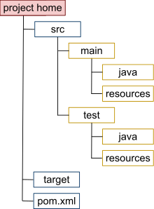

# Maven

It is crucial to understand Maven when using Spring because when you generate projects using the *Initializr*, you are generating a Maven project. 

## What is Maven?

Maven is your best friend. It is a project management tool created in 2004 designed for **build management** and **dependencies**. 

When building a project, you may need multiple *JAR* (Java Zip/ARchive) files, then you will add those JAR files to your build path / classpath. If you want to use Spring, Hibernate, and JSON in your project, without maven you have to go to each website to download them. **Maven does this automatically.**

## How Maven Works

The programmer writes the **project config file**, maven reads it, then checks the *Maven Local Repository* that's on your local computer cache. If not found, it will go to the remote *Maven Central Repository* and pull the JAR files needed, AS WELL AS ITS DEPENDENCIES. It saves any pulled JAR files in your local cache for use in your applications.

## Maven File Directory Structure



* `src/main/java` - java source code
* `src/main/resources` - config files used by app
* `(optional) src/main/webapp` - web assets like HTML, CSS, JavaScript
* `src/test` - Unit testing code and properties
* `target` - Destination directory for compiled code

## Project Coordinates

A typical house address has a city, street, and some house number. In Maven, that is `groupId`, `artifactId`, and `version` respectively.

A common project coordinate will look something like this:
```
<groupId>com.website<groupId>
<artifactId>project_name<artifactId>
<version>1.0-SNAPSHOT<version>
```

The elements are **G.A.V.**:
* `groupId` - reverse domain name of your company
* `artifactId` - name of project
* `version (optional)` - version of project (`SNAPSHOT` means active development)

Note: `version` should be included for *repeatable builds*

### How to find the coordinates

* [Maven Central Repository](search.maven.org)
* Go to the project page

## POM.XML

All the dependencies user wants to add are listed in the **Project Object Model** (POM) file. In it there is:

* **project meta data** - project name, version, output file type (packaging)
* **dependencies** which include  *starter* dependencies (packages of dependencies as one bundle)
* **project plugins** for customization

